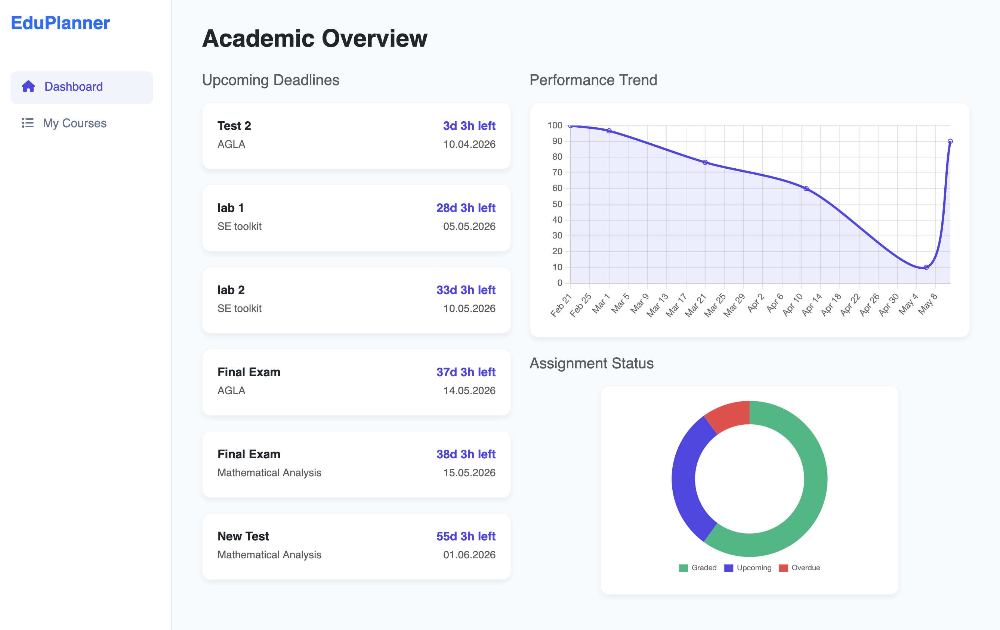
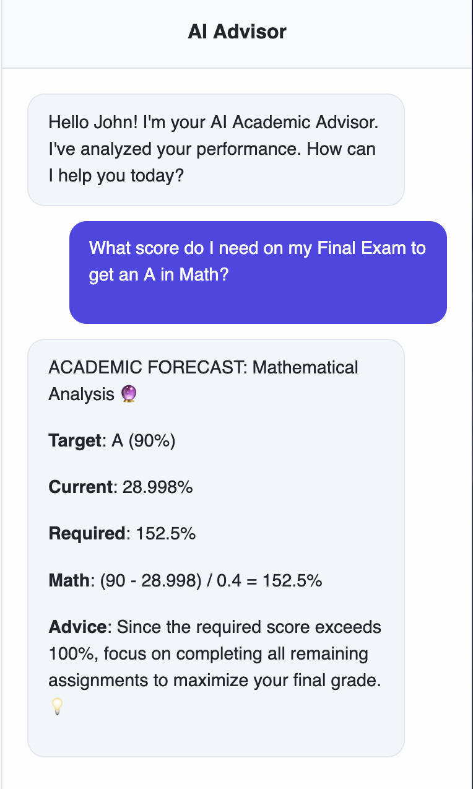

# LMS Smart Advisor & Planner

An intelligent academic assistant for planning studies, tracking weighted scores, and AI-driven grade forecasting.

## Demo


*The interactive dashboard showing performance dynamics and upcoming deadlines.*


*The AI Advisor providing grade forecasting and study recommendations.*

## Product Context

### End Users
The primary users are university students managing multiple courses with diverse grading structures and frequent deadlines.

### Problem
Students often struggle to track assignments with different weights (e.g., 20% for midterm, 40% for final), calculate exactly what score they need on future exams to achieve a target grade, and stay on top of approaching deadlines across all subjects.

### Solution
LMS Smart Advisor provides a centralized platform that automates weighted GPA calculations and provides real-time deadline countdowns. Its core innovation is an AI Advisor that uses academic data to forecast required performance and suggest prioritized study plans.

## Features

### Implemented
- **Interactive Dashboard:** Visual performance tracking using Chart.js and a real-time deadline countdown (e.g., "2d 5h left").
- **Course Management:** Full CRUD for courses and assignments, including editable weights and grade thresholds (A, B, C).
- **Weighted Scoring:** Automatic calculation of current weighted scores based on completed assignments.
- **AI Advisor:** A Qwen-powered agent that provides:
  - **Academic Forecasting:** Calculates the exact score needed on future tasks for a target grade.
  - **Progress Reports:** Summarizes current standing and "best" performing courses.
  - **Priority Lists:** Identifies the most impactful upcoming tasks.
  - **Deadlines Overview:** Quick summary of pending and overdue work.

## Usage

1. **Setup Courses:** Add your courses (e.g., "Mathematics", "Computer Science") in the Management tab.
2. **Add Assignments:** Define assignments for each course, specifying their weight (0.0 to 1.0) and deadline.
3. **Track Progress:** As you complete tasks, enter your scores (0-100) to see your weighted average update instantly on the dashboard.
4. **Consult the AI:** Open the Chat tab and ask the advisor questions like:
   - "What score do I need on my Final Exam to get an A in Math?"
   - "Give me a priority list of my upcoming tasks."
   - "Show me a progress report for all my courses."

## Deployment

> [!WARNING]
> The chatbot is powered by Qwen, which requires to auth in and update tokens after a certain period of time via Autochecker bot! Therefore, this function may not work if TA checks it.

### Operating System
This system is designed to run on **Ubuntu 24.04** or any modern Linux distribution with Docker support.

### Prerequisites
The following tools must be installed on the VM:
- **Docker** (version 20.10+)
- **Docker Compose** (version 2.0+)
- **Git** (for cloning the repository)

### Step-by-Step Instructions

1. **Clone the Repository:**
   ```bash
   git clone <repository-url>
   cd se-toolkit-hackathon
   ```

2. **Configure Environment:**
   Create a `.env` file from the example:
   ```bash
   cp .env.example .env
   ```
   *Note: Ensure the `LLM_API_BASE` in `.env` points to your active Qwen proxy if running locally.*

3. **Launch the Application:**
   ```bash
   docker-compose up --build -d
   ```

4. **Access the Services:**
   - **Frontend:** [http://localhost](http://localhost)
   - **Backend API:** [http://localhost:8000](http://localhost:8000)
   - **AI Agent (Nanobot):** [http://localhost:8080](http://localhost:8080)

6. **Stop the Application:**
   ```bash
   docker-compose down
   ```

